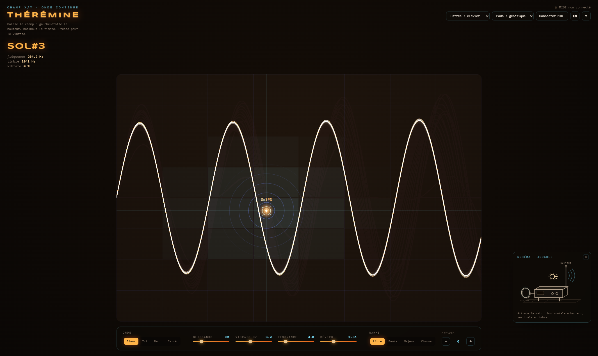

<h1 align="center">
  <br>
  Thérémine Experience
  <br>
</h1>

<p align="center">
  <a href="https://saythanks.io/to/GizMoDevOne" target="_blank">
    
  </a>
  <a href="https://www.paypal.me/GizMoDevOne" target="_blank">
    
  </a>
</p>

<p align="center">
A browser-based theremin played across a continuous X/Y field: sweep left↔right for pitch, bottom↔top for timbre. Built with plain HTML, CSS and the Web Audio API — no dependencies, no build step. Playable with mouse, touch, computer keyboard, or a MIDI controller (keyboard or X/Y pad grid).
</p>



**Table of Content**

- [Features ✨](#features-)
- [Tech Stack](#tech-stack)
- [Getting Started](#getting-started)
  - [Prerequisites](#prerequisites)
  - [Installation](#installation)
- [Usage](#usage)
  - [Mouse \& touch](#mouse--touch)
  - [Computer keyboard](#computer-keyboard)
  - [MIDI keyboard — input mode "clavier"](#midi-keyboard--input-mode-clavier)
  - [MIDI pads — input mode "pads X/Y"](#midi-pads--input-mode-pads-xy)
  - [Demo mode](#demo-mode)
  - [Bottom control panel](#bottom-control-panel)
- [Project Structure](#project-structure)
- [MIDI Implementation Details](#midi-implementation-details)
- [Contributing](#contributing)
  - [Bug Reports and Feature Requests](#bug-reports-and-feature-requests)
  - [Code Style](#code-style)
- [Author](#author)
- [🚀 About Me](#-about-me)
- [Acknowledgements](#acknowledgements)
- [Buy me a coffee](#buy-me-a-coffee)
- [Show your support](#show-your-support)
- [License](#license)

## Features ✨

* **X/Y field synthesis:** move across the field — horizontal position sets pitch (~C2 to C6), vertical position sets filter cutoff (timbre). Glissando (portamento) smooths every move into a continuous glide, true to a real theremin. The field spans the full width of the bottom control bar and the full height available, with corners rounded to match it.
* **4 waveforms:** sine, triangle, sawtooth, square, with a slightly detuned second oscillator for warmth.
* **Vibrato:** pressure-sensitive (pointer force, MIDI aftertouch, channel pressure, or mod wheel) LFO vibrato with adjustable rate.
* **Filter resonance & reverb:** a resonant low-pass filter plus a convolution reverb (impulse response generated at runtime, no sample files).
* **Scale quantization:** play fully free-pitch ("Libre"), or snap to pentatonic, major, or chromatic scales.
* **Octave transpose:** ±2 octaves.
* **Phosphor-persistence oscilloscope:** the canvas field doubles as a glowing, decaying oscilloscope trace of the live signal, auto-normalized to the signal's real peak so it always makes good use of the available height.
* **Playable SVG diagram:** a small draggable schematic of a theremin (bottom-right) mirrors and controls pitch/timbre — grab the hand to play. It hides itself automatically if it would overlap the field, and can be dismissed manually via its close button.
* **Mouse & touch:** move in the field to preview notes, press and hold to play, drag to glide; pointer force adds vibrato.
* **Computer keyboard:** `A W S E D F T G Y H U J K` play notes laid out like a piano; `↑ ↓` control timbre; `Z X` shift octave; `Shift` holds vibrato.
* **MIDI keyboard input:** monophonic legato play, pitch bend (±2 semitones) for glissando, mod wheel/aftertouch/channel pressure for vibrato, velocity for timbre, sustain pedal support.
* **MIDI pad input:** an 8×8 X/Y grid mode for pad controllers (generic layout or Akai/Novation-style Launchpad layout), with LED feedback lighting the pads nearest the played position.
* **Demo mode:** 17 short, instantly recognizable pieces play the instrument hands-free — science fiction (*Close Encounters*, *Star Trek*, *The X-Files*, *Blade Runner*, *2001*), film and TV (*The Imperial March*, *Jaws*, *Game of Thrones*, *Hedwig's Theme*), video games (*Tetris*, *Zelda*, *Halo*), and classical, including Saint-Saëns' *The Swan*, one of the pieces Clara Rockmore made famous on the theremin itself. The player drives the very same voice your hand would, so the field, the cursor, the oscilloscope and the playable diagram all react live, with the track's name displayed above the field. Touch anything to take over.
* **In-app help panel:** press `?` any time for a full reference of every input mode and control.
* **Bilingual interface:** French/English, auto-detected from your browser's language, with a manual switch (top bar) that's remembered on your next visit.
* **Responsive layout:** scales down cleanly to tablet and phone widths.

## Tech Stack


Zero dependencies: vanilla JavaScript, the Web Audio API for synthesis, and the Web MIDI API for controller input. No bundler, no build step.

## Getting Started

### Prerequisites

- A modern browser with Web Audio API support (Chrome, Firefox, Safari, Edge).
- **Web MIDI requires Chrome or Edge.** If you want to use a MIDI controller, open `index.html` directly in one of those browsers rather than an embedded preview — Web MIDI is blocked in most in-app/embedded viewers.

### Installation

1. **Clone the repository:**

    ```bash
    git clone https://github.com/GizMoDevOne/theremine.git
    cd theremine
    ```

2. **Open `index.html` in your browser** — no build step, no install required, no server needed. Double-clicking the file works.

    If you'd rather serve it locally (e.g. for MIDI testing across devices on the same network):

    ```bash
    # If you have Python installed:
    python -m http.server
    # Then navigate to http://localhost:8000
    ```

## Usage

Click **"Mettre sous tension"** (or press `Space`) on the boot screen to start the audio engine.

### Mouse & touch

| Action                     | Effect                                                           |
| -------------------------- | ---------------------------------------------------------------- |
| Move in the field          | Pitch follows X, timbre follows Y                                |
| Press & hold               | Play the note; drag for continuous glissando                     |
| Force (finger/stylus)      | Adds vibrato                                                     |
| Hover                      | The reticle previews the note at that position                   |
| SVG diagram (bottom-right) | Grab the hand and move it: horizontal = pitch, vertical = timbre |

### Computer keyboard

| Keys                        | Effect                       |
| --------------------------- | ---------------------------- |
| `A W S E D F T G Y H U J K` | Notes, laid out like a piano |
| `↑` `↓`                     | Timbre (filter opening)      |
| `Z` `X`                     | Octave down / up             |
| `Shift`                     | Vibrato while held           |
| `Space`                     | Power on at boot             |
| `?` / `Escape`              | Open / close the help panel  |

### MIDI keyboard — input mode "clavier"

Notes drive pitch in monophonic legato (last note wins); pitch bend glides continuously (±2 semitones); mod wheel and aftertouch control vibrato depth; sustain pedal holds the note after release; velocity brightens the timbre.

### MIDI pads — input mode "pads X/Y"

Each pad maps to a point on the field (column = pitch, row = timbre); aftertouch (e.g. Akai MPD218) adds vibrato; pad LEDs light up around the played point as feedback. Choose "générique" or "Launchpad" pad mapping to match your controller's layout.

### Demo mode

| Action                        | Effect                                                                |
| ----------------------------- | --------------------------------------------------------------------- |
| `▶` button (top bar)          | Opens the track list; pick one and the instrument plays it by itself   |
| `▶ Play the demo` (boot screen) | Powers on and starts the first track straight away                    |
| Field / key / MIDI            | Takes over: the demo stops and your own settings are restored          |

### Bottom control panel

Waveform, glissando speed, vibrato rate, filter resonance, reverb amount, scale (free / pentatonic / major / chromatic), and octave.

## Project Structure

```
theremine/
├── index.html            entry point — markup + external asset links
└── assets/
    ├── css/
    │   └── style.css      all styles
    ├── js/
    │   ├── state.js        shared constants, params, voice state, pitch/filter mappings
    │   ├── i18n.js          language detection/switch (FR/EN), translated strings, note names
    │   ├── audio.js          Web Audio graph (oscillators, filter, LFO, reverb)
    │   ├── input.js           pointer/touch field + computer keyboard, voice lifecycle
    │   ├── midi.js             Web MIDI: connection, note/CC handling, pad LED feedback
    │   ├── render.js            canvas: geometry, field grid, oscilloscope, cursor, reticle
    │   ├── ui.js                 controls, help panel, playable SVG diagram
    │   ├── demo.js                hands-free playback: melodies + track picker
    │   └── main.js                 entry script: render loop, bootstrap, wiring
    └── img/
        ├── favicon.svg           app icon
        └── theremin-screen.png   README screenshot
```

## MIDI Implementation Details

* `navigator.requestMIDIAccess({ sysex: false })` requests access to MIDI devices.
* All connected input ports are subscribed simultaneously, so it doesn't matter which port a controller exposes.
* In **pads** mode, incoming Note-On messages are mapped to a cell of an 8×8 grid (`36 + row*8 + col` for a generic layout, or a Launchpad-style row/column scheme); Note-On/Off drives voice start/stop, aftertouch drives vibrato.
* In **keys** mode, Note-On/Off drives a monophonic legato voice (last held note wins), pitch bend maps to glissando, velocity maps to timbre.
* Pad LEDs are echoed back on the first available MIDI output using Note-On (velocity scaled by proximity to the played point) / Note-Off, so lit pads visually track the played position on hardware that supports MIDI-in LED feedback.

> This project is a sincere homage to Sheldon Cooper's theremin performance in *The Big Bang Theory* — [watch the scene](https://www.youtube.com/watch?v=i7v1R7_85IY).

## Contributing

We welcome contributions to improve Thérémine! Here's how you can help:

1. Fork the repository.
2. Create a new branch (`git checkout -b feature-branch`).
3. Commit your changes (`git commit -m 'Add new feature'`).
4. Push to the branch (`git push origin feature-branch`).
5. Open a pull request.

### Bug Reports and Feature Requests

If you encounter any issues or have ideas for new features, please create an issue on the [GitHub Issues](https://github.com/GizMoDevOne/theremine/issues) page.

### Code Style

Please follow the existing code style and conventions. Ensure your code is clean and well-documented.

## Author

- [@GizMoDevOne](https://github.com/GizMoDevOne)

## 🚀 About Me
I'm a simple web developer, passionate about music and technology. I love creating innovative and user-friendly applications that make a positive impact on people's lives.

## Acknowledgements

- Thanks to all contributors and users who have provided feedback and suggestions.
- Inspired by various interactive music tools and performance applications.

## Buy me a coffee

Whether you use this project, have learned something from it, or just like it, please consider supporting it by buying me a coffee, so I can dedicate more time on open-source projects like this :)

<a href="https://www.buymeacoffee.com/GizMoDevOne" target="_blank"></a>

## Show your support

Please ⭐️ this repository if this project helped you!

## License

This project is licensed under the terms of the **MIT** license.
You can check out the full license [here](https://github.com/GizMoDevOne/theremine/blob/main/LICENSE)
<a href="https://github.com/GizMoDevOne/theremine/blob/main/LICENSE" target="_blank">
    
</a>

---

Happy playing!
